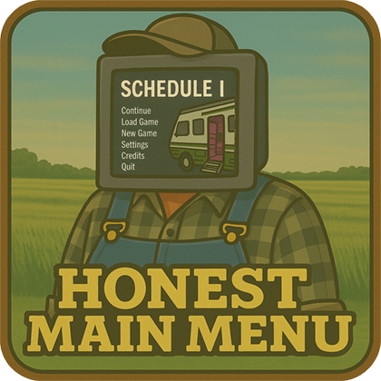

[](https://www.scheduleonegame.com/)
[](https://melonwiki.xyz/#/)
[](https://github.com/RoachxD/ScheduleOne.HonestMainMenu/releases/latest)
[](LICENSE.md)

Ever felt like the main menu in Schedule I was... well, not entirely straight with you? Like it was holding back, maybe even telling a few white lies? You're not alone.

Introducing **Honest Main Menu**, a mod forged in the fires of mild annoyance and a desire for a menu that just tells it like it is. The main culprits for this mod's existence:

* That "Continue" button? More like "Continue to a screen where you pick a save, which is basically Load Game, isn't it?". Deceptive.
* The back button prompt whispering sweet nothings about using your Right Mouse Button (RMB), when only the trusty Escape key actually did the job in the main menu. Misleading.
* And the grand finale: watching the main menu scene load itself not once, not twice, but *thrice* when you just wanted to quit to menu. Inefficient. (Seriously, the "Menu" scene would load twice on startup and then *again* three times when exiting a game session. What gives?)

This mod slaps some honesty into the main menu, offering a true "Continue" experience, clarifying the "Load Game" process, and attempting to curb the menu's enthusiasm for redundant self-loading.

## Features

* **True "Continue" Functionality:** Adds a new, dedicated "Continue" button that *actually* loads your most recently played game session. Revolutionary, I know.
* **Repurposed "Load Game" Button:** The original "Continue" button (the one that masqueraded as a "Load Game" button) is now properly labeled "Load Game". It still opens the save selection screen, but at least it's honest about it.
* **Updated Load Screen Title:** The title of the screen you get when you click "Load Game" now says "Load Game" instead of "Continue". Because clarity is kindness.
* **Corrected UI Prompts:** The misleading "RMB" indicator from the main menu's back button prompt has been banished. Escape key is your only friend here.
* **Scene Load Optimization ([`Patches.SceneManagerLoadScenePatch`](Patches/SceneManagerLoadScenePatch.cs)):** Includes a Harmony patch for `SceneManager.LoadScene`. This bad boy acts as a bouncer, preventing the game from loading the same scene multiple times consecutively. While the *real* party crasher seems to be how the game handles network disconnections and related events, fixing that is a whole other can of worms. This patch just mitigates the symptom of your menu UI getting rebuilt more times than a LEGO castle in a hurricane.
* **Dual Build Support:** Comes in both Il2Cpp and Mono flavors, because options are nice.

## How It Works

**Honest Main Menu** gets to work in two main stages:

### On Mod Initialization (Taming the Scene Loader)

* **Streamlined Menu Loading:** Right off the bat, the mod applies the [`Patches.SceneManagerLoadScenePatch`](Patches/SceneManagerLoadScenePatch.cs). This helps prevent the main menu scene from reloading unnecessarily, aiming for a smoother startup and a less jarring transition when you bail from a game session back to the menu.

### On Main Menu Scene Load (The Honesty Makeover)

Once you actually *see* the main menu, the mod rolls up its sleeves:

1. **Finds Menu Parts:** It scans the existing menu, locating the buttons and text elements.
2. **Creates and Updates Buttons:**
    * A shiny new "Continue" button is conjured. Clicking this loads your latest save. No fuss, no muss.
    * The game's original "Continue" button gets a new name and label: "Load Game". It still takes you to the save list, but now it's upfront about it.
3. **Rearranges Buttons:** The new "Continue" button takes the prime spot of the old one. The "Load Game" button (formerly "Continue") is nudged down a bit, and other menu items shuffle politely to make space.
4. **Clarifies Load Screen:** If you click the "Load Game" button, the title of the screen that pops up is changed from "Continue" to "Load Game". Consistency!
5. **Fixes Back Button Info:** The on-screen tip for the back button is corrected, removing the phantom RMB functionality.
6. **Smart Button Activation:** The new "Continue" and "Load Game" buttons will only be active if you actually have saved games. No saves? They'll be greyed out, because teasing is mean.

## Installation

1. Ensure you have [MelonLoader](https://melonwiki.xyz/#/) installed for Schedule I.
2. Download the appropriate mod flavor from the latest [Releases page](https://github.com/RoachxD/ScheduleOne.HonestMainMenu/releases/latest).
    * If your game is the IL2CPP (default) version, download `HonestMainMenu.Il2Cpp.dll`.
    * If your game is the Mono (alternate) version, download `HonestMainMenu.Mono.dll`.
3. Place the downloaded `.dll` file into the `Mods` folder within your Schedule I game directory.
4. Launch the game. Cross your fingers. Maybe.

## Configuration

This mod is a simple creature. It has no external configuration options. What you see is what you get.

## What's Next?

* [ ] Investigate replacing the in-game main menu title logo with the higher-quality version used on the game's official website and Steam store page. Because the current one looks like it was made in MS Paint during a coffee break.

## Contributing

Got suggestions, found a bug, or just want to share your own tales of menu-induced bewilderment? Feel free to open an issue or pull request on the project's GitHub repository.

### Building from Source

So, you want to tinker with the innards? Brave. Here’s the drill:

1. **Prerequisites:**
    * [.NET SDK](https://dotnet.microsoft.com/download): Make sure it's installed. The project targets .NET 6.0 for Il2Cpp builds and .NET Framework 4.7.2 for Mono builds (check [`ScheduleOne.HonestMainMenu.csproj`](ScheduleOne.HonestMainMenu.csproj) for specifics).
2. **Game Directory Setup:**
    * You'll need an environment variable named `ScheduleOneGameDir`. This bad boy needs to point to the root directory of your Schedule I game installation (e.g., `C:\Program Files (x86)\Steam\steamapps\common\Schedule I`).
    * This path is crucial for the build process to find game assemblies and to heroically copy the built mod DLLs into your game's `Mods` folder.
3. **Build Configurations:**
    * The project supports several build configurations, detailed in [`ScheduleOne.HonestMainMenu.csproj`](ScheduleOne.HonestMainMenu.csproj) and [`ScheduleOne.HonestMainMenu.sln`](ScheduleOne.HonestMainMenu.sln):
        * `Debug_Il2Cpp` / `Release_Il2Cpp`
        * `Debug_Mono` / `Release_Mono`
4. **Building the Mod:**
    * **Using an IDE (e.g., Visual Studio, JetBrains Rider):** Open the [`ScheduleOne.HonestMainMenu.sln`](ScheduleOne.HonestMainMenu.sln) solution file and build it. Pick your poison (configuration-wise).
    * **Using the .NET CLI:** Open your terminal, navigate to the project's root, and use the `dotnet build` command. For instance, to build the Il2Cpp Release version:

        ```shell
        dotnet build -c Release_Il2Cpp ScheduleOne.HonestMainMenu.csproj
        ```

    * **VS Code Users:** The repository includes a [`.vscode/tasks.json`](.vscode/tasks.json) file which defines build tasks for all configurations. You can run these tasks directly from VS Code (e.g., by pressing `Ctrl+Shift+B` and selecting a build task, or by running "Tasks: Run Build Task" from the Command Palette).
5. **Output:**
    * The compiled mod (`.dll` file) will appear in the `bin\[Configuration]\[TargetFramework]` subfolder (e.g., `bin\Release_Il2Cpp\net6.0`).
    * The post-build event (defined in [`ScheduleOne.HonestMainMenu.csproj`](ScheduleOne.HonestMainMenu.csproj)) will also try to politely (or not so politely, via `taskkill /F`) close `Schedule I.exe` if it's running, then copy the fresh mod DLL to the `Mods` folder in your `ScheduleOneGameDir`.

## Credits

* **[Roach_ (Adrian Nicolae)](https://github.com/RoachxD):** The slightly disgruntled developer of this mod.
* **vic95v:** My long-suffering friend and designated guinea pig, who bravely ventured into the treacherous lands of.. Multi-Player Lobbies, to help me test the "Continue" button. Your sacrifice (and suggestions) will be remembered. Mostly.
* **[MelonLoader Team](https://melonwiki.xyz/#/):** For MelonLoader, the magic that makes this all possible.
* **[Tyler's Video Game Studio](https://www.scheduleonegame.com/presskit/schedule-one/index.html#about):** For creating Schedule I, a game that's fun enough to warrant this kind of nitpicking.

## License

This project is licensed under the MIT License. See the [`LICENSE.md`](LICENSE.md) file for the riveting legal details.
